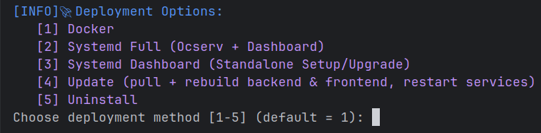

# OpenConnect VPN Server (Ocserv) with Dashboard

A simple, efficient, and scalable solution to deploy and manage an **OpenConnect VPN server (ocserv)**
with a powerful **web-based dashboard**.  
Easily manage users, groups, and server configurations while keeping your VPN secure and performant.

<p align="center">
  
</p>

<p align="center">
  
  
  
  
  
</p>

<p align="center">
  
  
  <br>
  <i>Dashboard UI Preview</i>
</p>

---

## 🌟 Key Features

### 1. Ocserv User Management
- Create, update, remove, block, and disconnect users with ease.
- Sync the `ocpasswd` file with the database to keep user credentials consistent.
- Set traffic usage limits per user (e.g., GB or monthly quotas).
- Manage account expiration to automatically deactivate users when their subscription ends.

### 2. Ocserv Group Management
- Create, update, and delete user groups.
- Sync the `/etc/ocserv/groups/*` files with the database to ensure consistent group configurations.
- Organize users into logical groups for easier management.

### 3. Ocserv Command-Line Tools
- Use the `occtl` CLI utility to perform various server operations efficiently.

### 4. Ocserv User Statistics & Monitoring
- View real-time statistics for user traffic (RX/TX).
- Track data usage per user and per group.

### 5. Ocserv Live Server Logs
- Monitor Ocserv logs in real-time directly from the web dashboard.

### 6. Staffs and Staff Management
- Manage admin accounts: create, update, delete, and reset passwords.
- Track staff activities and administrative actions for accountability.
- Each staff member can create and manage **their own Ocserv Users and Groups**. 
  Staff members cannot view or modify users/groups created by others;  
  only admin users have full access.

### 7. Customer Account Details & Usage
- View detailed customer account information.
- Monitor user-specific usage summaries and traffic data.

### 8. Internationalization (i18n)
- Multi-language support:
  - English (**en**)
  - Russian (**ru**)
  - Simplified Chinese (**zh-cn**)
  - Traditional Chinese (**zh-tw**)
  - Arabic (**ar**)
  - Persian (**fa**)

### 9. Telegram Bot
- Self-service Telegram bot that lets your customers interact with their VPN accounts:
  - **Link existing account**: customers send their VPN username/password to the bot to associate it with their Telegram chat. One chat can manage many accounts.
  - **Usage check**: customers see remaining quota, expiry date and online status for each linked account on demand.
  - **Renewal requests**: customers pick a package and submit a renewal request. The admin is notified in Telegram.
  - **New account orders**: new customers can order a fresh account by picking a package and a desired username.
  - **Receipt-based payment workflow**: after admin approval the customer is asked to upload a payment receipt (photo). The admin reviews the receipt in the dashboard, confirms the payment and the bot automatically delivers the credentials (or extends the existing account).
  - **Low-quota warnings**: customers receive an automatic warning message when remaining quota drops below a configurable threshold (default 200 MB).
  - **Multi-language**: bot conversations and notifications are available in English and Persian, selectable per chat.
- Admin-side dashboard pages (under the `Telegram` section in the sidebar):
  - **Settings**: enable/disable the bot, paste the BotFather token, set admin chat ID, low-quota threshold, default language and Ocserv host.
  - **Packages**: CRUD for the plans customers can pick (title, days, traffic size, traffic type, price text, active flag).
  - **Requests**: review pending requests, view uploaded receipts, approve, reject or confirm payment, with optional admin notes.
  - **Linked accounts**: each Ocserv user detail page lists every Telegram chat linked to that account, with a one-click unlink action.
- **Custom Telegram copy & bot metadata:** see [docs/telegram-translations.md](docs/telegram-translations.md) for `TELEGRAM_I18N_PATH` (API messages), `TELEGRAM_BOT_I18N_PATH` (directory of bot UI `*.json` locale files), and `TELEGRAM_BOT_METADATA_LOCALES_PATH` (BotFather descriptions).

---

## ⚠️ Legacy Version Note

- **Branch name:** [legacy](https://github.com/mmtaee/ocserv-dashboard/tree/legacy)
- **Old version:** Developed using **Python backend** with **Vue 2 frontend**.
- **Features:** Minimal, limited functionality compared to the current version — only basic user and group management existed.

---

## ⚙️ System Requirements

- **Docker-based:**
  - [Docker v28.5 or higher](https://docs.docker.com/engine/install/)
  - [Docker Compose v2.40 or higher](https://docs.docker.com/compose/install/)

- **Systemd-based:**
  - **Supported Operating Systems:**
    - [Debian 12 or higher](https://www.debian.org/download)
    - [Ubuntu 20.04 or higher](https://ubuntu.com/download/server)

  - **Programming Language:**
    - [Golang v1.25 or higher](https://go.dev/dl/)

---

## 🚀 Quick Start

1. Clone the repository:
```bash
git clone https://github.com/mmtaee/ocserv-dashboard.git

cd ocserv-dashboard

chmod +x install.sh

./install.sh
```
then select an option to continue:
<p>
  
</p>

---

## 🌐 Access the Admin Dashboard

1. Open your web browser.
2. Navigate to `https://YOUR-DOMAIN-OR-IP:3443` in the browser.
3. Complete the administrative setup wizard.
4. Start managing users, groups, and VPN settings from the dashboard.

---

## 🌐 Access the Customers page for quick insights

1. Open your web browser.
2. Navigate to `https://YOUR-DOMAIN-OR-IP:3443/summary/` in the browser.
3. Enter your Ocserv username and password to see insights.

---

## 🤖 Configuring the Telegram Bot

The dashboard ships with an integrated Telegram bot service (`telegram_bot`) that runs alongside `api`, `log_stream` and `user_expiry`. Configuration lives entirely in the database — there is no need to edit `.env` or restart anything manually after a token change.

1. Create a new bot with [@BotFather](https://t.me/BotFather) and copy the token.
2. Open the dashboard, navigate to **Telegram → Settings** and paste the token, set your admin chat ID, low-quota threshold, default language and the Ocserv host that customers will see when they receive new credentials.
3. Toggle **Bot enabled** on and save. Within ~30 seconds the bot service detects the change, connects to Telegram and starts polling for updates.
4. Define one or more sellable plans in **Telegram → Packages**.
5. Send `/start` to your bot in Telegram. Customer flows (link account / view usage / order new / renew / upload receipt) are now active.
6. Incoming requests appear in real time under **Telegram → Requests** where you approve them, review uploaded receipts and confirm payment. The bot delivers the resulting credentials (or renewal confirmation) automatically.

Receipt photos uploaded by customers are stored under `/opt/ocserv_dashboard/uploads/receipts/` (created by the installer with `0750` permissions).

---

## 🔒 Security & Scalability

- Designed with **best practices for security** to ensure a safe and reliable VPN environment.
- The web panel is intuitive and easy to use for both administrators and end users.
- Scalable architecture allows efficient management of multiple users and groups.
- Real-time usage tracking and monitoring built-in.
- If you encounter any issues, please refer to the documentation or contact support.

---

## 🧭 Roadmap / TODO

The planned features and upcoming improvements are tracked in the **[TODO.md](TODO.md)** file.

Check it out to see what's coming next!

---

## 🌍 Contributing to Translations (i18n)

We welcome community contributions to improve and expand internationalization (i18n) support!

### 📁 Translation Files Directory
All web dashboard translation files are located at:

[web/src/locales/](https://github.com/mmtaee/ocserv-dashboard/tree/master/web/src/locales)

Each language has its own JSON file (e.g., `en.json`, `it.json`, `zh.json`, `ru.json`, etc.).

### 🛠️ How to Contribute

1. Go to the [locales](https://github.com/mmtaee/ocserv-dashboard/tree/master/web/src/locales) directory.
2. Choose an existing language file to improve, or create a new `<lang>.json` file for a new language.
3. Add all required translation keys with proper JSON structure.
4. Make sure the JSON syntax is valid.

### 🔧 Update the Installer (Required for New Languages)

After adding a new `<lang>.json` file, you **must update the `install.sh` file**:

Open 👉 [install.sh](https://github.com/mmtaee/ocserv-dashboard/blob/master/install.sh)

Find the line that defines supported languages, and add your new language in the same format, comma-separated.

Example (adding Spanish):

**LANGUAGES=en:English,it:Italiano,zh-tw:中文(繁體),zh-cn:中文(简体),ru:Русский,fa:فارسی,ar:العربية,es:Español**

Contributing translations and updating the installer helps ensure the dashboard supports users around the world.

---

## 📦 License

This project is licensed under the **MIT License** — see the [LICENSE](LICENSE) file for details.

---
## 📈 Star History

[](https://www.star-history.com/#mmtaee/ocserv-dashboard&Date)
